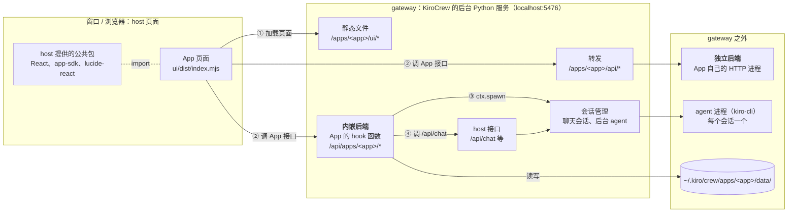
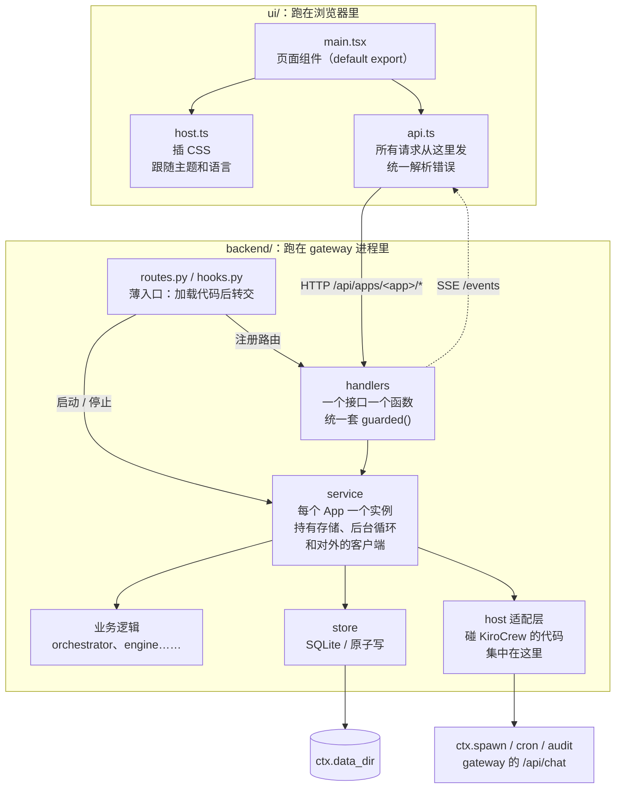

# KiroCrew App 开发指南（实战版）

> 内容来自我们自己做过的四个 App，以及一台开发机上装着的 30 个 App（包括官方 builtin）：
>
> | App | 仓库 | 形态 | 一句话 |
> |---|---|---|---|
> | **aidlc-studio** | [warren830/kirocrew-app-aidlc](https://github.com/warren830/kirocrew-app-aidlc) | 内嵌后端 + React 页面 + 1 个只读 agent | AI-DLC 的审批中心，已发布到 v1.1.5 |
> | **devteam** | `warren830/dev-team`（私有） | 内嵌后端 + React 页面 + 4 个角色 agent | 由代码编排多个 chat session 组成开发团队 |
> | **kirocrew-team** | `warren830/kirocrew-team`（私有） | 内嵌后端 + React 页面 | 8 个角色协作做网站，配一个实时看板 |
> | **workshop-customizer** | [warren830/kirocrew-app-adlc](https://github.com/warren830/kirocrew-app-adlc)（`app/`） | 独立后端 + 少量内嵌接口 + 手写的 JS 页面（没有构建步骤） | 把客户需求整理成 Workshop 场景包 |
>
> “内嵌后端”“独立后端”这些词在 §0 里解释。**第一次写 App，先读 §0。**
>
> **适用版本**：KiroCrew desktop **0.8.0-insider.12**。以 KiroCrew.app 安装包里自带的那份 Python 代码为准：
> `/Applications/KiroCrew.app/Contents/Resources/backend-dist/kirocrew-backend-arm64/lib/python3.12/site-packages/kiro_crew/apps/`
> 下文用 `$K` 代指这个目录。本地 checkout 的 KiroCrew 开源源码停在 0.3.0，manifest 校验、后端加载、hook 机制都和现在对不上，**只能当参考，不能当依据**。
> KiroCrew 一升级，先重新核对 §4 和 §5 里引用的行号。

---

## 0. 先认识 KiroCrew App

这一章讲清楚 KiroCrew 和 App 各由哪几块组成、App 的代码跑在哪里。后面各章会直接用这里的名词。

### 0.1 KiroCrew 由哪几块组成

KiroCrew 桌面版由两部分组成：

- **gateway**：后台的 Python 服务（基于 aiohttp），默认监听 `localhost:5476`，可以用环境变量 `KIROCREW_PORT` 改端口。KiroCrew 的功能几乎都在它里面：提供网页和 `/api/*` 接口、管理聊天会话、跑定时任务、加载 App。gateway 一停，整个 KiroCrew 就用不了。
- **窗口**：一个 Electron 壳，显示的是 gateway 提供的网页。用浏览器登录同一个地址，看到的也是这套界面。

每个聊天会话（chat session）背后都有一个 agent 进程，默认是 kiro-cli。这些进程都由 gateway 启动和管理。

本文用 **host** 指 KiroCrew 本身，用来和 App 区分：“host 页面”是 KiroCrew 的网页界面，“host 接口”是 gateway 自带的 `/api/*`。

### 0.2 App 是什么

App 是装进 KiroCrew 的扩展，本质上是一个目录，通常就是一个 git 仓库。它最多由四部分组成，都登记在根目录的 `app.json` 里。`app.json` 叫 **manifest**，相当于 App 的说明书：名字、版本、页面入口、后端怎么接、要哪些权限。

| 部分 | 内容 | 装好之后由谁运行 |
|---|---|---|
| 页面 | `ui/dist/index.mjs`：一个 React 组件打包成的 JS 文件 | 浏览器。用户在侧边栏点开 App 时，host 页面 `import()` 这个文件，把它当作一个页面显示出来 |
| 后端 | Python 代码：App 自己的接口和后台任务 | gateway。有内嵌和独立两种接法（§0.3） |
| agent | `agents/*.json`：agent 配置，写明 prompt 和能用哪些工具 | kiro-cli。安装时复制成 `~/.kiro/agents/<app>--<file>.json` |
| 素材 | 图标、头图、截图 | App 商店和侧边栏 |

安装时，KiroCrew 会把整个目录**复制**到 `~/.kiro/crew/apps/<app>/`，之后运行的都是这份副本。所以改了源码要重新安装才生效（§8.2）。App 运行时产生的数据放在副本里的 `data/` 目录，代码里通过 `ctx.data_dir` 拿到这个路径。

### 0.3 后端的两种接法：hook 和 ctx

后端怎么接进 KiroCrew，是写 App 时最先要定的事（怎么选见 §2）。

**内嵌后端**：manifest 里写 `backend.hooks`，官方叫 in-process hooks。gateway 直接 import App 的 Python 文件，代码跑在 **gateway 自己的进程里**。App 通过几个约定好的函数接入，这些函数就叫 **hook**：

| hook | gateway 什么时候调用 | App 在里面做什么 |
|---|---|---|
| `routes` | App 启用时，调用一次 | 返回 App 的接口列表。之后访问 `/api/apps/<app>/...` 的请求，gateway 都转给列表里对应的函数处理 |
| `on_startup` | App 启用时，紧接着 `routes` 调用 | 打开存储，启动后台循环 |
| `on_shutdown` | App 停用时 | 停掉后台任务，收尾 |

每个 hook 都会收到一个 **`ctx`**（类型是 `AppContext`）。它是 gateway 交给 App 的工具箱，常用的有：

- `ctx.data_dir`：App 的数据目录；
- `ctx.storage`：简单的键值存储；
- `ctx.spawn`：让 gateway 在后台跑一次 App 自带的 agent；
- `ctx.cron`、`ctx.job`、`ctx.events`、`ctx.audit`：定时任务、长任务、事件、安全日志（§5.5）。

manifest 的 `permissions` 里没申请的能力，对应字段就是 `None`。

**独立后端**：manifest 里写 `backend.entryPoint`。App 自己就是一个 HTTP 服务。App 启用时，gateway 把它当作子进程启动，再把 `/apps/<app>/api/...` 的请求转发过去。它和 gateway 是两个进程，卡住了也拖不垮 gateway，但是拿不到 `ctx`。

App 也可以完全没有后端，只有页面，直接调 host 接口。

> 本文说的 hook，指的都是上面这三个 **App hook**。agent 也有自己的 hook（`userPromptSubmit`、`preToolUse` 等），那是 kiro-cli 的机制，App 挂不上去（§5.5）。

### 0.4 架构全景



图里编号的是 App 最常见的三类请求：

1. **加载页面**：用户点开 App，host 页面向 gateway 请求 `/apps/<app>/ui/dist/index.mjs`，再 `import()` 它。页面里用到的 React、`@kirocrew/app-sdk`、`lucide-react` 不在这个文件里，而是由 host 页面通过 import map 统一提供，所以打包时要把它们排除掉（§7.1）。
2. **调 App 自己的接口**：内嵌后端的地址是 `/api/apps/<app>/...`，独立后端的地址是 `/apps/<app>/api/...`。请求带着用户的登录 cookie，gateway 先确认是谁，再交给 App。内嵌后端能从 `request["user"]` 拿到用户，还要自己检查是不是 owner（§4.4）。独立后端收到的请求里，cookie 已经被去掉，换成了 gateway 的签名，App 要校验这个签名（§6）。
3. **调 AI**：内嵌后端可以用 `ctx.spawn` 在后台跑一次自带的 agent，跑完拿结果；也可以调 host 的 `/api/chat`，往用户看得见的聊天会话里发消息（§5）。两条路最后都交给会话管理，由它启动 kiro-cli 进程。

### 0.5 推荐的 App 内部分层

aidlc-studio、devteam、kirocrew-team 是分头写的，最后却收敛到了同一种结构：



- **薄入口**（`routes.py`、`hooks.py`）只做两件事：用一段样板代码加载 `backend/<pkg>/` 里的模块（§4.2），再把调用转交给 handlers 和 service。这里不放业务逻辑，因为它一出错，App 的所有接口都会消失（§4.4）。
- **handlers**：一个接口对应一个函数，全部套上同一个 `guarded()`，统一做身份检查和错误格式（§4.4）。
- **service**：App 的总管，每个 App 一个实例，持有存储、后台循环和对外的客户端。它按 App 名登记，这样 `on_shutdown` 才能找到它并关掉（§4.3）。
- **业务逻辑和 store**：尽量写成不依赖 gateway 的纯 Python，这样不启动 KiroCrew 也能测（§9.1）。
- **host 适配层**：要读 KiroCrew 内部对象、调 gateway 接口的代码，尽量集中在一两个模块里，比如 kirocrew-team 的 `kc.py`、aidlc-studio 的 `sessions.py`、devteam 的 `gateway.py`。KiroCrew 升级后有东西变了，只用改这一处。
- **页面**：`main.tsx` 只是页面组件，请求都走一个 `api.ts`（aidlc-studio、devteam 都这么做）。aidlc-studio 还把和 host 打交道的适配（插 CSS、跟随主题和语言）集中到了 `lib/host.ts`（§7.2）。

### 0.6 名词表

| 词 | 意思 |
|---|---|
| host | KiroCrew 本身，相对 App 而言。host 页面是 KiroCrew 的网页界面，host 接口是 gateway 自带的 `/api/*` |
| gateway | KiroCrew 的后台 Python 服务，默认在 `localhost:5476`。网页、接口、聊天会话、App 都归它管 |
| manifest | App 根目录的 `app.json`，App 的说明书 |
| hook | manifest 里登记、由 gateway 在固定时机调用的 App 函数：`routes`、`on_startup`、`on_shutdown`（§0.3） |
| 内嵌后端 | 写 `backend.hooks` 的后端。代码跑在 gateway 进程里，接口地址是 `/api/apps/<app>/...`。本文默认推荐这种 |
| 独立后端 | 写 `backend.entryPoint` 的后端。单独一个进程，gateway 把 `/apps/<app>/api/...` 转发给它 |
| ctx | gateway 交给内嵌后端的工具箱对象（`AppContext`）。没申请的能力是 `None`（§0.3） |
| 启用 / 停用（enable / disable） | 打开或关闭一个已安装的 App。启用时 gateway 才加载后端代码、注册接口，停用时卸掉。后端代码改了，要停用再启用才会重新加载 |
| degraded | App 还开着，但有一部分出了问题，比如接口没注册上。`GET /api/apps` 里能看到 |
| 执行授权（trusted apps） | 允许某个 App 的代码（hook、独立后端、安装脚本）在本机运行，也就是 App 名出现在配置项 `agent.apps_trusted` 里。没授权的 App 也能显示“已启用”，但代码不会运行 |
| agent | 一份 JSON 配置，规定 prompt 和能用哪些工具，kiro-cli 按它干活 |
| 聊天会话 / slot | 用户在 KiroCrew 里开的一个对话，背后是一个 kiro-cli 进程。gateway 的接口里管它叫 slot，用 key 区分 |
| spawn | App 让 gateway 在后台跑一次自带的 agent（`ctx.spawn.run`），跑完拿结果。期间的工具调用全部自动批准 |
| 工具审批 | agent 要写文件、跑命令时，先征求用户同意。申请了 `sessionApproval` 的 App 可以替自己的会话回答（§5.3） |
| YOLO / trust 模式 | 让工具调用不经询问直接执行的设置。YOLO 是全局开关，有时限；trust 是单个会话的审批模式，和上面的执行授权无关。开着的时候，审批不会送到 App |
| owner | 这台 KiroCrew 的主人，也就是本机的用户。App 的接口一般只对 owner 开放（§4.4） |
| app token | App 后端以“App 自己”的身份调 gateway 接口时用的临时凭证，5 分钟有效（§5.2）。它和用户的登录 cookie 是两种身份 |
| import map / external | host 页面用 import map 统一提供 React、SDK 这些公共包。App 打包时把它们标成 external，不打进自己的文件，运行时用 host 的那一份 |
| registry | 一个 JSON 清单，列出可安装的 App 和它们的 git 地址。App 商店里的列表就来自这些清单（§10） |
| SEL | 安全事件日志（Security Event Log），`ctx.audit` 写到这里 |

---

## 1. 三十秒速览

1. **默认用内嵌后端**（manifest 写 `backend.hooks`）。页面用 Vite 的 library 模式打成一个 `ui/dist/index.mjs`，React 和 SDK 标成 external，运行时用 host 的那份。我们三个主力 App 都是这么做的。
2. **gateway 按文件路径加载后端，不会把你的目录加进 `sys.path`**，所以直接 `import` 自己的模块会失败。解决办法是在 `routes.py` 和 `hooks.py` 顶部各放一段同样的加载代码（namespace bootstrap，§4.2），直接从 devteam 抄。
3. **别卡住 gateway**。内嵌后端和 gateway 共用一个事件循环，读写磁盘、调子进程都要放进 `asyncio.to_thread`。事件循环卡住大约 25 秒，gateway 进程就会被杀掉，整个 KiroCrew 跟着中断。
4. **`ctx.storage` 只适合放配置**。它就是一个 key 一个 JSON 文件：没有“先比较再写入”（CAS），并发写会互相覆盖；写完也不刷盘（fsync），断电可能丢数据。重要的状态放进 `ctx.data_dir` 下的 SQLite，或者用“写临时文件 → 刷盘 → 改名”的原子写。
5. **调 AI 有三条路**：
   - `ctx.spawn.run`：在后台跑一次本 App 自带的 agent。工具调用会自动批准，所以给 agent 的工具越少越好；
   - 调 gateway 的 `/api/chat`：往用户看得见的聊天会话里发消息，适合多个 agent 协作；
   - `ctx.cron`：定时让 agent 跑一轮。
6. **改完代码用 `dev-install.sh` 重新装**：停用 → 更新 → 授权 → 启用。**永远不要卸载重装**，卸载会把执行授权一起删掉。
7. **发布**：打 tag，把 `release` 分支 fast-forward 到这个 tag，在团队 registry 里登记。仓库要小，因为安装时 `git clone --depth 1` 只给 60 秒。

---

## 2. 先选架构

### 2.1 三种后端形态

| 形态 | manifest | 路由挂在哪 | 适用 | 代价 |
|---|---|---|---|---|
| **无后端** | 不写 `backend` | – | 纯前端工具，只调 host API（agent-worlds、projects 等） | 没有服务端状态 |
| **内嵌后端**（推荐） | `backend.hooks.routes/on_startup/on_shutdown` | `/api/apps/<name>/<path>` | 绝大多数场景。可以直接用 `ctx.*` SDK 和 aiohttp `request`，可以自己做 SSE | 和 gateway 同进程、无沙箱；一阻塞就拖垮整个 gateway；第三方 pip 依赖不好用（§4.7） |
| **独立后端** | `backend.entryPoint` + `port:"auto"` + `healthCheck:"/health"` | `/apps/<name>/api/<path>`，由 gateway 反向代理 | 需要自带依赖或 venv、跑重活，或者想与 gateway 隔离（md-notebook、workflows、workshop-customizer） | 每个请求都要校验 gateway 的 HMAC 签名；代理有 **30 秒总超时**；**不支持 WebSocket**；拿不到 `ctx`（spawn、job 都用不了） |

workshop-customizer 两种都用：独立后端负责主要业务和 ADLC console（嵌在 App 页面里的控制台）；凡是要用 `ctx.spawn` 的活，都交给内嵌后端的接口来做。内嵌后端的 `routes.py` 也会被独立后端按路径加载，两边共用一套代码（`kirocrew-app-adlc/app/backend/server.py:496-509`）。

### 2.2 选择规则

- 要调 agent，或者要用 `ctx.storage`、`ctx.audit`、`ctx.job` → 选**内嵌后端**。
- 有请求会超过 30 秒、需要 WebSocket，或者需要 numpy 这类原生依赖 → 选**独立后端**。也可以混用：独立后端扛重活，内嵌后端的接口负责调 spawn。
- 两种都不用写也行。KiroCrew 自带的 command-bar 连页面和后端都没有，只用 `ui.overlays` 换掉了 host 的快速搜索框（quick-search）。

---

## 3. 目录骨架与 manifest

### 3.1 推荐布局（aidlc-studio 和 devteam 一致）

```
<app>/
├── app.json                 # manifest（放在仓库根目录；如果放子目录，安装时要加 subdirectory，见 §9.4）
├── backend/
│   ├── routes.py            # 给 host 的薄入口：bootstrap + register_routes
│   ├── hooks.py             # 给 host 的薄入口：bootstrap + on_startup/on_shutdown
│   └── <pkg>/               # 真正的逻辑：service、handlers、store、orchestrator……（只用相对 import）
├── agents/*.json            # App 自带的 agent
├── ui/
│   ├── package.json  vite.config.ts  vitest.config.ts  tsconfig.json
│   ├── src/                 # main.tsx 的 default export 就是页面组件
│   ├── types/kirocrew-app-sdk.d.ts   # 只声明 host 真正 export 的名字
│   └── dist/index.mjs, style.css     # ★ 构建产物要提交进 git
├── assets/                  # icon-512.png、hero*.png、screenshots/*.png（只接受 PNG/WebP/JPEG）
├── scripts/  check.sh  dev-install.sh  kcapi.sh
├── tests/                   # pytest；UI 测试放在 ui/src/**/*.test.tsx
└── docs/
```

`kirocrew app scaffold` 生成的骨架默认是**独立后端**，用 `http.server`（`$K/scaffold.py:170-221`）。想做内嵌后端，最好直接照抄 devteam 的骨架，而不是在 scaffold 生成的结果上改。

### 3.2 app.json 速查

必填字段：`name`（kebab-case，满足 `^[a-z0-9]+(?:-[a-z0-9]+)*$`，**不能有点号**）、`version`（严格 semver，`1.0` 不合法）、`displayName`、`description`。

aidlc-studio 的写法可以直接当模板用（删减后）：

```json
{
  "name": "aidlc-studio",
  "version": "1.1.5",
  "displayName": "AI-DLC Studio",
  "description": "…",
  "author": "ychchen",
  "license": "Apache-2.0",
  "minKiroCrewVersion": "0.3.0",
  "tags": ["developer-tools"],
  "iconPath": "assets/icon-512.png",
  "heroImage": "assets/hero-light.png", "heroImageDark": "assets/hero-dark.png",
  "screenshots": ["assets/screenshots/a.png"],
  "agents": ["agents/advisor.json"],
  "backend": { "hooks": {
    "routes": "backend.routes:register_routes",
    "on_startup": "backend.hooks:on_startup",
    "on_shutdown": "backend.hooks:on_shutdown"
  }},
  "ui": {
    "entry": "dist/index.mjs",
    "pages": [{ "route": "/apps/aidlc-studio", "label": "AI-DLC Studio", "icon": "GitBranch", "iconUrl": "icon.svg" }],
    "sidebar": { "section": "Apps", "order": 10 }
  },
  "permissions": {
    "api": ["/api/apps/aidlc-studio", "/api/chat"],
    "events": ["aidlc-studio:action"],
    "storage": true, "spawn": true, "cron": false, "network": false, "memory": ""
  },
  "dependencies": { "commands": [], "optionalCommands": ["bun", "git"] },
  "platform": { "os": ["macos", "linux"], "installMode": "server" }
}
```

**manifest 里的坑**：

| 坑 | 说明 |
|---|---|
| `ui.entry` 的相对基准是 `ui/` | 要写 `dist/index.mjs`。写成 `ui/dist/...` 会解析成 `ui/ui/...`（`$K/manifest.py:616-620`） |
| hook 路径里只能用标识符 | 格式必须是 `module.path:callable`，所以模块名和目录名都不能带连字符，比如 `backend/my-routes.py` 无法引用 |
| 权限布尔值必须是字面量 `true` | 写成字符串 `"true"` 等于拒绝；列表写成字符串会变成 `[]`。这类错误**都不报**，结果只是对应的 `ctx.spawn` 之类变成 `None` |
| 未知的顶层 key 不报错 | 会被存进 `extra`，hook 里通过 `ctx.config` 读到。拼错的 key 因此不会被发现 |
| `minKiroCrewVersion` 只比较数字部分 | `0.8.0-insider.12` 会按 `0.8.0` 处理 |
| `permissions.api` 只按前缀匹配 | 前端 SDK 的 allowlist **不认 `*`**，要声明普通前缀。builtin mochi 写了 `/api/apps/mochi/*`，但它编译在 host 包里，不走这条校验 |
| `sessionApproval: true` | App 能替**自己的** session 回答工具审批，但这个能力也够得着用户自己的 session，必须自己加归属校验（§5.3） |
| `platform.os` | 默认是 macos+linux。要支持 Windows 必须显式写上，而且 setup 脚本依赖 bash |
| 保留路径段 | `_jobs, config, dev, disable, enable, manifest, migrate-cleanup, open, token, uninstall, update` 归 host 所有，App 路由用了这些名字会被遮蔽（`$K/manifest.py:1353-1365`） |

其他可选字段：`crons[]`、`setup.{onInstall,onUpdate,onEnable,onDisable,onUninstall}`（bash 脚本，默认 30 秒超时）、`contributes.{commands,panelTabs,fileMenuItems,sessionControls}`、`notifications.channels`（最多 8 个）、`mcpServers`、`skills`、`jobFamilies`。完整的表在 `$K/manifest.py:2320-2348`。

---

## 4. 内嵌后端

这一章讲内嵌后端（§0.3）：代码跑在 gateway 进程里，通过 `routes`、`on_startup`、`on_shutdown` 三个 hook 接入。

### 4.1 加载机制（必须先理解）

一句话：gateway 按文件路径分别加载 `routes.py` 和 `hooks.py`，你的 `backend/` 目录不在 Python 的 import 搜索路径里。细节如下：

- host 把 `"backend.routes:register_routes"` 换算成文件路径 `<app>/backend/routes.py`，用 `spec_from_file_location` 加载，模块名是 `_kirocrew_app_<name>.backend.routes`（`$K/module_loader.py:285-346`）。
- **`sys.path` 不会被改动**。写 `import backend.util` 或者 `import mypkg` 这种绝对 import 都会失败。
- `routes.py` 和 `hooks.py` 是**两个互不相干的模块**，模块级变量不共享。
- 后端代码只在启用（enable）时重新 import。gateway 另有一个后台检查（reconciler），每 15 秒看一次已装 App 在磁盘上有没有变化（比如被命令行重装过），有变化就自动停用再启用（`$K/hook_reconcile.py:92`）。但关键步骤别依赖它，还是用 `dev-install.sh` 显式操作。
- 第三方代码在 gateway 进程里跑，**没有沙箱**。还必须拿到执行授权，也就是 App 名在 `agent.apps_trusted` 里，否则 App 显示“已启用”，但 hooks、routes、crons 都不会运行。

### 4.2 加载样板代码：namespace bootstrap（直接复制）

真正的代码放在 `backend/<pkg>/` 里。入口文件先在 `sys.modules` 里登记一个虚拟的包（namespace 包），让它指向 `backend/` 目录，再通过这个包 import `<pkg>` 下的模块。这样 `<pkg>` 里可以正常写相对 import，在 gateway 里和在 pytest 里表现一致。**`routes.py` 和 `hooks.py` 各放一份一模一样的代码**：

```python
# backend/routes.py（hooks.py 顶部放完全相同的 bootstrap 段）
from __future__ import annotations
import importlib, importlib.machinery, importlib.util, sys
from pathlib import Path

_BACKEND_DIR = Path(__file__).resolve().parent
_NS = "_myapp_backend"            # 每个 App 用不同的名字
_REQUIRED = ("service", "handlers")

def teardown_namespace() -> None:
    prefix = f"{_NS}."
    for key in [k for k in sys.modules if k == _NS or k.startswith(prefix)]:
        sys.modules.pop(key, None)

def bootstrap():
    for final in (False, True):
        root = sys.modules.get(_NS)
        if root is not None and list(getattr(root, "__path__", ())) != [str(_BACKEND_DIR)]:
            teardown_namespace(); root = None          # 安装目录变了：丢掉旧的 namespace
        if root is None:
            spec = importlib.machinery.ModuleSpec(_NS, None, is_package=True)
            root = importlib.util.module_from_spec(spec)
            root.__path__ = [str(_BACKEND_DIR)]
            sys.modules[_NS] = root
        try:
            mods = {n: importlib.import_module(f"{_NS}.myapp.{n}") for n in _REQUIRED}
        except BaseException:
            teardown_namespace(); raise                # ★ 失败时必须清掉，否则下次 enable 拿到的还是坏模块
        if all(mods.values()):
            return mods
        teardown_namespace()
        if final:
            raise ImportError(f"{_NS}.myapp imported incompletely")

_mods = bootstrap()
service, handlers = _mods["service"], _mods["handlers"]

def register_routes(ctx):
    from kiro_crew.apps.route_registry import AppRoute   # host 模块，在 gateway 里一定存在
    svc = service.get_or_build(ctx)
    return handlers.build_routes(svc, AppRoute)
```

```python
# backend/hooks.py（bootstrap 段之后）
async def on_startup(ctx) -> None:
    await service.get_or_build(ctx).start()

async def on_shutdown(ctx) -> None:
    try:
        svc = service.discard(getattr(ctx, "name", "myapp"))
        if svc is not None:
            await svc.stop()
    finally:
        teardown_namespace()      # 下次 enable 从磁盘重新读代码
```

出处：`dev-team/backend/routes.py:19-72`、`dev-team/backend/hooks.py:66-76`。aidlc-studio 和 kirocrew-team 用的也是同一套。

### 4.3 Service 按 App 名注册

service 就是 §0.5 图里的总管对象。`register_routes` 和 `on_startup` 拿到的是同一个 ctx，**`on_shutdown` 拿到的却是新的 ctx**。所以 service 要按 App 名放进一个注册表，关闭时按名字取出来：

```python
_REGISTRY: dict[str, Services] = {}
def get_or_build(ctx):
    name = getattr(ctx, "name", APP_NAME) or APP_NAME
    return _REGISTRY.setdefault(name, Services(ctx))
def discard(name): return _REGISTRY.pop(name, None)
```

### 4.4 路由与鉴权

- `register_routes(ctx)` 必须返回 `list[AppRoute(method, path, handler)]`，handler 的签名是 `async def handler(request, ctx)`。返回的不是 list，或者元素不是 AppRoute，都会被跳过，App 被标成 degraded。
- path 用相对路径，例如 `/health`、`/runs/{id}`，参数在 `request.match_info` 里。精确匹配优先于带参数的模式。
- **`register_routes` 里不要做重活**：它一抛异常，所有路由都没了，包括 `/health`。
- **把 `web` 和 `is_owner` 当参数注入**：写成 `build_routes(svc, AppRoute, web=aiohttp.web, is_owner=...)`，测试时换成 `FakeWeb`，不需要启动 gateway（`dev-team/backend/devteam/handlers.py:229-253`）。
- **统一用一个 `guarded()` 包装器**（`dev-team/backend/devteam/httpkit.py:60-97`）：
  - 没有 `request["user"]` 返回 401；
  - 有 `request["app"]`，也就是 app token 发来的请求，返回 403；
  - 不是 owner 返回 403，owner 判断用 host 的 `is_owner_dashboard_request`，import 失败按“不是 owner”处理；
  - 业务异常统一转成 `{error, code}` JSON。
  - `/health` 不加 guard。
- 在测试里把路由表钉住：路由缺失、重复，或者用了保留路径段，都让测试失败（`aidlc-studio backend/studio/handlers/common.py:580-603`）。

### 4.5 生命周期与后台循环

- 同步 hook 直接在事件循环上执行，会阻塞循环。**hook 一律写成 async**。
- async 的 `on_startup` 只有 **30 秒**。超时后任务**不会被取消**，而是转到后台继续跑，这期间再次 startup 会被拒绝。所以 `on_startup` 里只做“打开存储 + `create_task` 启动循环”，然后立刻返回。
- **gateway 可能还没准备好**：KiroCrew 启动时，App 的 `on_startup` 比聊天会话的恢复更早执行。要调 `/api/chat` 的循环，跑第一轮之前先轮询 `GET /api/ready`（`dev-team/backend/devteam/service.py:52-61`）。
- `on_startup` 时 `request.app` 还不存在，host 的状态要等第一个请求进来才拿得到。别在启动时依赖它做决定，aidlc-studio 在这里踩过真 bug（`docs/open-defects.md:573-584`）。
- 循环骨架可以参考 devteam：
  - 繁忙时每 1 秒跑一轮，空闲时每 20 秒一轮；
  - 有写请求时调 `poke()` 立刻唤醒；
  - 出错时指数退避，最长 15 秒；
  - 每轮只拉一次会话列表，因为 `GET /api/chat/slots` 每次要 30-60ms。
- **`on_shutdown` 必须停掉所有后台任务**：先 cancel 加 `wait_for(…, 5)`，再 flush，最后关闭存储和 HTTP session。任务留着不停，reconciler 会一直持有旧记录，不再重启这个 App。
- 启动阶段出问题，用 `ctx.health.mark_degraded(...)` 标记，不要直接抛异常。

### 4.6 存储选型

| 需求 | 用法 | 出处 |
|---|---|---|
| 少量配置、偏好 | `ctx.storage.get/set/delete/list_keys`，每个 key 存成一个 JSON 文件（`data/kv/<key>.json`） | `$K/app_storage.py` |
| 要事务、要防并发写互相覆盖 | `ctx.data_dir/xxx.sqlite3`：单连接加 `RLock`，`BEGIN IMMEDIATE`，WAL，`synchronous=FULL`，设 `busy_timeout`，开 `foreign_keys=ON` | `aidlc-studio backend/studio/storage.py:560-585` |
| 运行记录、事件流 | 普通文件，原子写（tmp → fsync → `os.replace`）；JSONL 按 `\n` 切行，**不要用 `splitlines`**（它会在 U+2028 处断开记录）；写到一半断掉的末行要修复；读到坏 JSON 就改名成 `.corrupt` 再返回默认值 | `dev-team/backend/devteam/store.py` |

规则：所有 IO 都走 `asyncio.to_thread`。JSON 先在事件循环上序列化好再交给线程，免得线程读到一个正在被修改的 dict。

### 4.7 依赖

- 内嵌后端**最好只用标准库**，aiohttp 由 host 提供。`requirements.txt` 会被 `pip install --target` 装进 `data/.kirocrew-deps`，但只有 **spawn 出来的进程**能通过 PYTHONPATH 看到。内嵌后端的模块不会改 `sys.path`，**多半看不到这些包**（这是读代码得出的推断，没有实测）。确实需要的话，就像 workshop-customizer 那样把依赖 vendor 进来，或者改用独立后端。
- `dependencies.commands` 只做 `shutil.which` 检查，缺了会报告，但不会阻止安装或运行。

### 4.8 推送给前端：自己写 SSE

host 目前**不会把 `app_event` 转发给 App 前端**，SDK 的 `useAppEvents` 也收不到事件（aidlc-studio 实测）。做法是：

- 后端自己提供 `GET /events` 的 SSE（aiohttp `StreamResponse`），再加一个 `/events/poll` 作为降级；
- 前端给每种事件类型分别 `addEventListener`，因为带 `event:` 字段的 SSE 帧不会进 `onmessage`；
- 要求不高的话，直接轮询也可以，比如 devteam 每 2 秒拉一次 `/state`。

---

## 5. 和 Agent 打交道

### 5.1 `ctx.spawn`：调用 App 自带 agent 做一次性分析

```python
spawn = ctx.spawn            # manifest 里没写 permissions.spawn: true 时是 None，一定要判断
if spawn is None: raise Unavailable()
spawn_id = await spawn.run(task=prompt, agent="aidlc-studio-advisor", silent=True)
# 之后用 spawn.is_done(spawn_id) 轮询；未知的 id 也会被当成 done
```

- `agent` 参数传的是 agent JSON 里的 `name`。只有本 App 安装出来的 agent 才能用，也就是文件名为 `~/.kiro/agents/<app>--*.json` 的那些。传 host 默认 agent 或其他 App 的 agent，会抛 `SpawnError` 并写一条审计（`$K/spawn_sdk.py:160-195`）。
- **spawn 以 `approval_mode="auto"` 运行，工具调用全部自动批准，不会问用户。所以 agent 的 `tools` 列表就是唯一的防线**。
  - aidlc-studio 的 advisor 只给了 `["thinking"]`，所有证据都在 prompt 里一次给全，输出要求是一个固定 key 的 JSON 代码块。
  - workshop-customizer 的 agent 没有任何工具，只返回数据，等用户点了 Apply 才写盘。
- 完成事件里的结果会被截断到 3000 字符，完整内容要去读 `result_path`。
- 返回空 id 表示 host 拒绝了（策略或配额原因），`run` 会抛异常。

### 5.2 `/api/chat`：驱动真实的 chat session（多 agent 编排）

需要用户看得见、能随时接手的会话（devteam 每个角色一个会话），或者要触发只在用户发消息时才运行的流程（比如 AI-DLC 挂在 agent 的 `userPromptSubmit` hook 上，aidlc-studio 就是这种情况）时，走 gateway 的 chat 接口。有两种做法：

| 做法 | 例子 | 关键点 |
|---|---|---|
| **UI 用用户的 cookie 发请求** | aidlc-studio | 后端先记一条“发送中”（Delivering）的记录，再把要发的请求内容返回给页面；由浏览器带着用户的 cookie 调 `POST /api/chat?ws=1`，再把发送回执（receipt）交回后端。创建 slot 的顺序固定为 create → title → project → agent（`agent_kind:"template"`），**agent 必须在 project 之后设置**，否则 host 拒绝 |
| **后端用 app token 发请求** | devteam | 读取 `<app_dir>/.app_secret`，带 `X-App-Secret` 头调 `POST /api/apps/<app>/token` 换 token，放在 `?token=` 里。token 有效期 5 分钟，每 240 秒主动续一次。只有响应带 `X-Auth-Required` 时才重试，handler 自己返回的 403 就是最终结果。只连 loopback 地址（`dev-team/backend/devteam/gateway.py`） |

devteam 踩过的 chat API 坑，写编排时一定要防：

1. **`POST /api/chat` 会把不存在的 key 默默建成一个空白会话**，刚关掉的 key 也会。发送前先查 slot 列表；每次都带上 `agent`，并记下 slot 的 `created` 时间戳，时间戳变了就当作另一个会话。
2. App 发的消息只会排队，不能插到当前回合里。而且排队后只保留 `sendId`，所以要靠 `sendId` 加正文里的标记来识别自己发出的消息。
3. **防重复派发**：每次派发前先把状态记成 `dispatching` 写盘，重启后到 transcript 里找 `sendId` 和标记，找到了就不再重发。kirocrew-team 的做法是在任务首行打上 tag，找到 tag 就接管已存在的会话。
4. `reset-conversation` 不传 `replay` 时默认是 `true`，要**显式传 `replay: false`**。
5. 第一次 `/stop` 是软停止，要先取消自己排队的消息再 stop。被打断的回合用 `/continue` 续一次。
6. 回合完成的判断：连续两次轮询都是 idle 才算完。超时只计算“看到它在工作”的时间。忙了 20 分钟 transcript 却没有新行，就判为卡住。
7. session 在连续三次列表里都不见了才算丢失。**不要自动重建**，交给人来决定。

### 5.3 替 session 审批工具调用（`sessionApproval`）

- 必须做**归属校验**：只对 `app=<自己>`、key 已登记、`created` 时间戳也对得上的 slot 回答审批。devteam 把这个约束封装成一个只能在满足条件时构造出来的 `OwnedSlot` 类型（`dev-team/backend/devteam/guard.py`）。
- **YOLO 模式，或者会话本身设成了 trust 审批模式（§0.6），审批就根本到不了 App**：host 在转给 App 之前就已经放行了。devteam 实测 19 次调用一次也没到。所以开跑前要读 `/api/admin/compliance/yolo-status`，开着就拒绝运行，运行中途打开就暂停。trust 模式的会话用 `mode=normal` 重置。
- 写文件的审批，`tool_input` 是渲染好的 unified diff，`tool_kind` 为空。要解析 `---`/`+++` 行，**不能当 JSON 读**。
- 审批记录一旦被回答就会从列表里消失，所以待审批时就要抓下 `tool_call_id` 和时间戳。180 秒没人回答会被自动拒绝。
- kiro-cli 重启后 request id 会从头编号，去重要用 request id 加 tool、kind、input 一起比较。
- 顺序：先把决定写盘，再回答，最后写一条 `ctx.audit.record(...)`。

### 5.4 `agents/*.json` 的规矩

- 安装时文件被复制成 `~/.kiro/agents/<app>--<file>.json`。`name, mcpServers, tools, allowedTools, prompt, managedToolPolicy, includeMcpJson, resources` 这几个字段每次注册都会重新生成，其余字段保留。
- **prompt 里只要出现 `${VAR}` 或者 `{UPPERCASE}` 这样的占位符，agent 就会被静默跳过，不注册**。devteam 用 `test_agent_specs.py` 专门拦这个问题。
- agent 的权限可以设计成：`tools` 宽、`allowedTools` 窄（只读），写入和 shell 用 `permissions.rules` 设为 `"ask"`，这样每次都会到 App 这里审批。注意：`permissions.rules` 对 kiro-cli 不生效（`dev-team/product-design.md`）。
- 有大量 agent 时用脚本生成，并且从后端常量 import 端口和路径，保证 prompt 和策略引擎一致（`dev-team/scripts/gen_agents.py`）。
- agent 在用户仓库里跑时，KiroCrew 会写 `.kiro/settings/cli.json`，要让用户的 `.gitignore` 包含 `.kiro/`。
- 跑的 agent 的 cwd 必须在 `~/workplace` 或 `~/workspace` 之下（kirocrew-team 的 `constants.py:9-11`）。

### 5.5 其他 SDK

| SDK | 用途 | 注意 |
|---|---|---|
| `ctx.cron` | 定时触发 agent 回合 | 在 handler 和 `on_startup` 里**必须用 `*_async` 版本**，同步版本会抛 `CronSyncOnLoopError`。cron 不能回调 App 代码 |
| `ctx.job` | 用户在前台发起的长任务，有 dedupe，可取消 | 在 `on_startup` 里 `register(kind, fn)`。`fn` 跑在线程里，要定期调 `handle.checkpoint()`。记录里没有结果，结果需要自己存 |
| `ctx.events` | 发布事件 | 发布没声明过的类型会抛 `PermissionError`。前端收到的类型是 `app_event`，数据会被脱敏。目前转发不到 App 前端（§4.8） |
| `ctx.audit` | 写安全事件日志（SEL） | 永远不会抛异常。SEL 只保留 1000 条，别刷屏：devteam 的 `kcapi.sh` 曾经每次请求都调一下 `/auth/me`，SEL 行数翻了一倍 |
| `ctx.scrub.outbound(text)` | 对外发布前去掉凭证和 URL | 抛 `PlatformCompositionError` 时就不要发布了 |

App **不能**挂 agent 的 hook（`userPromptSubmit`、`preToolUse` 等），这些只能由用户自己在配置项 `agent.kiro_hooks` 里设置。

---

## 6. 独立后端要点

- 环境变量：`PORT`、`KIROCREW_APP_NAME`、`KIROCREW_PROXY_SECRET`、`KIROCREW_HOME`。
- 每个请求都要校验 `X-KiroCrew-Proxy: <ts>:<hmac>`：`from kiro_crew.apps.proxy_auth import verify_proxy_request`，允许 ±60 秒的时间偏差，校验失败就拒绝。**`/health` 不签名**，因为 gateway 的探活请求本身不带签名。
- 代理会去掉 `cookie` 和 `authorization` 头。总超时 30 秒。SSE 能透传，WebSocket 不行（`upgrade` 头会被去掉）。
- 需要超过 30 秒，或者要给外部调用方开 API，可以另开一个 loopback 端口（workshop-customizer 的 `/v1` 在 8772 端口）。
- 解释器的选择顺序：gateway 的 Python 已经有 deps 树时直接用它；否则用 `<app>/.venv/bin/python3`，前提是能证明它可用且 Python 版本一致；再不行回到 gateway 的 Python。gateway 不会帮你创建 venv。缺依赖时，也可以像 workshop-customizer 那样自己 re-exec 到仓库的 `.venv`。

---

## 7. 前端

### 7.1 构建配置（照抄即可）

```ts
// ui/vite.config.ts
export default defineConfig({
  plugins: [react()],
  build: {
    lib: { entry: 'src/main.tsx', formats: ['es'], fileName: () => 'index.mjs' },
    outDir: 'dist', emptyOutDir: false, cssCodeSplit: false, sourcemap: false, target: 'es2022',
    rollupOptions: {
      external: ['react', 'react-dom', 'react-dom/client', 'react/jsx-runtime',
                 '@kirocrew/app-sdk', '@kirocrew/app-sdk/ui', 'lucide-react'],
      output: { assetFileNames: 'style[extname]' },
    },
  },
})
```

- React 放 devDependencies 或 peerDependencies。**bundle 里出现第二份 React，所有 hook 都会坏**。`dev-install.sh` 里要 grep bundle 中的 React 内部符号，发现了就失败。
- `main.tsx` 的 **default export 就是页面组件**，不接收 props。一个 App 想要多个视图，用 `?view=` 在组件里切换即可（devteam 就这么做），不必注册多个 page。
- `ui/dist/` **要提交进 git**。安装时会跳过 `node_modules`，只有 `package.json` 在 App 根目录时才会自动构建。

### 7.2 运行时注意事项（都是实测踩出来的）

1. **host 不会加载 App 的 CSS**。在入口处自己插入 `<link href="/apps/<app>/ui/dist/style.css">`（`aidlc-studio ui/src/lib/host.ts:154-165`）。样式只用 host 的 CSS 变量。CI 里 grep bundle，发现硬编码的十六进制颜色就失败。
2. **只能 import host 真正 export 的名字**。具名 import 一个不存在的名字，链接阶段直接 SyntaxError，整个页面白屏。
   - 在 `ui/types/kirocrew-app-sdk.d.ts` 里只声明真正存在的名字。
   - lucide 只有大约 40 个具名 export，其他图标统一走 default export 的 Proxy。
   - 加一个测试：把源码和 bundle 里的具名 import 跟**本机安装的 host vendor 包的 export 列表**比对（devteam `test_ui_imports.py`、workshop-customizer `test_ui_static.py`）。
3. **调 API**：`useAppApi()` 只接受绝对路径，并且必须落在 `permissions.api` 声明的前缀里。相对路径会被解析到 `http://localhost`，悄悄变成错误的 URL。SDK 抛出的错误是字符串 `API <status>: <body>`，要统一解析（`aidlc-studio ui/src/lib/api.ts`）。读请求可以带 `signal` 取消；写请求不应该取消，因为服务端可能已经提交了。
4. **主题和语言**：SDK 的 `useTheme().mode` 在非默认主题下不准，`useNotify` 和 `useAppEvents` 都不触发。用 MutationObserver 监听 `<html data-mode>` 和 `<html lang>`，再配合 `useSyncExternalStore`（`aidlc-studio ui/src/lib/host.ts:1-104`）。语言优先级依次是：App 内的设置、`localStorage['mc-lang']`、`<html lang>`、浏览器语言。
5. **i18n**：import map 里没有 i18next，只能自己写一个轻量的翻译器，再用脚本检查各语言的 key 是否对齐（`scripts/build_i18n.py --check`）。
6. 侧边栏的徽标用 `useNavBadge`（devteam 在用）。
7. 后端和 UI 共用的常量（错误码、枚举）用脚本生成到 UI 侧，并在 CI 里检查是否过期（`scripts/gen_ui_sources.py`）。手写两份迟早会对不上。

### 7.3 前端测试

vitest + jsdom。把 `@kirocrew/app-sdk`、`@kirocrew/app-sdk/ui`、`lucide-react` 用 alias 指向 `src/test/stubs/*`（`aidlc-studio ui/vitest.config.ts`）。kirocrew-team 另外配了一份 `vite.preview.config.ts`，把 React 打进包里并内联脚本，产物能直接用 `file://` 打开预览。

---

## 8. 开发循环

### 8.1 鉴权：`kcapi.sh`

gateway **不支持 `Authorization: Bearer`**，只认 cookie。流程是：用 gateway 自己的 Python 跑 `python -m kiro_crew token`，签出一个 5 分钟有效的 link token；用它访问 `/?token=` 换成 session cookie，存进 cookie jar 复用。

```bash
scripts/kcapi.sh GET  /api/apps
scripts/kcapi.sh POST /api/apps/<app>/enable '{}'
```

- 桌面版 Python 的路径：`/Applications/KiroCrew.app/Contents/Resources/backend-dist/kirocrew-backend-arm64/bin/python3.12`。可以用 `KC_PY` 覆盖。Docker 和 Linux 上直接用 `python3`。
- 先检查 cookie jar 是否还有效，再决定要不要重新签 token，不要每次都调一遍 `/api/auth/me`。

### 8.2 安装与更新：`dev-install.sh`

```
build UI → node --check dist/index.mjs → （grep bundle：不能带 React）
已安装 ? POST /api/apps/<app>/disable + POST /api/apps/<app>/update {"source": "<abs path>"}
       : POST /api/apps/install {"source": "<abs path>"}
POST /api/security/trusted-apps/<app>      # 只信任这一个 App
POST /api/apps/<app>/enable
[--dev] POST /api/apps/<app>/dev {"enabled": true}
GET /api/apps（看 hooks、backend_status） + GET /api/apps/<app>/health
```

- **永远不要 uninstall**，那会把 trust 授权一起删掉。一定要先 disable 再 update，因为 hook 模块只在 enable 时重新 import。
- 有首次 enable 时需要用户同意的权限（比如 `sessionApproval`），加 `--consent-session-approval` 之类的参数一并提交。
- 安装后的代码是一份**完整拷贝**，放在 `~/.kiro/crew/apps/<app>/`，`installed.json` 里的 `source` 记录源目录。改完源码不重新安装，gateway 里跑的还是旧代码。

### 8.3 UI 热更新：dev mode

- 打开后 `ui/` 下的文件以 `no-store` 方式返回。系统每秒轮询一次 `ui/` 目录，有变化就通过 WebSocket 推送 `app_reload`。
- 要实现“改完即生效”，只能**把整个 `ui/` 目录 symlink 到源码**。单个文件做 symlink 会 404，因为打开文件时用了 `O_NOFOLLOW`。指向安装目录之外时，CLI 需要加 `--confirm-out-of-install-root`，而且必须在宿主终端里执行，不能在 agent 沙箱里跑。
- **后端改动不会热更新**，要重新跑 `dev-install.sh`。

### 8.4 排查清单

| 现象 | 先看什么 |
|---|---|
| 页面白屏 | 浏览器控制台有没有 `SyntaxError: ... does not provide an export named`，属于 §7.2 第 2 条 |
| 页面没有样式 | 有没有插入 `<link>` 引入 style.css |
| 路由 404，或 App 显示 enabled 但不工作 | `GET /api/apps` 里的 hooks 状态；`agent.apps_trusted` 里有没有这个 App；`register_routes` 是否抛了异常 |
| 改了代码不生效 | 有没有 disable 再 update；有没有残留的 namespace（bootstrap 里有没有 teardown） |
| gateway 卡顿或被杀 | 事件循环上有没有同步 IO；hook 是不是写成了同步函数 |
| `ctx.spawn` 是 None | `permissions.spawn` 是不是字面量 `true` |
| agent 没注册上 | prompt 里有没有 `${}` 或 `{UPPER}` 占位符；JSON 是否合法 |
| 重启后 App 报 repo moved | macOS 重新挂载后设备号会变，`st_dev:st_ino` 跟着变了，需要重新绑定（aidlc-studio 的情况） |

---

## 9. 测试与质量门

### 9.1 后端测试

- `backend/<pkg>/` 尽量写成**不依赖 host 的纯 Python**。`conftest.py` 把 `backend/` 加进 `sys.path`，或者像 aidlc-studio 那样**按 host 的方式按路径加载入口文件**，并构造一个真实的 `AppContext`（`aidlc-studio tests/conftest.py`）。
- 运行时用 KiroCrew 的 venv：KiroCrew 源码 checkout 里的 `.venv/bin/python -m pytest tests -q -o addopts=`。此外再用桌面版自带的 Python 3.12 import 一遍后端，确认真实运行时能加载。
- **伪造 gateway 要贴近真实行为**。devteam 的 `tests/fakes.py` 用真实 transcript 截取的数据作为行格式，并模拟了几处真实行为：写入审批是 diff 文本；180 秒自动拒绝；队列 replay 后只保留 sendId。
- **契约测试**：读本机安装的 KiroCrew 源码，对 AST 做断言，并钉住 `CONTRACT_KIROCREW_VERSION`。host 版本一变，测试就失败，提醒你重新核对（`dev-team/tests/test_contract_kirocrew.py`）。
- **对真实 gateway 做冒烟**：`dev-team/scripts/contract_live.sh`。前置条件是 `/api/ready` 返回 200、版本匹配、当前没有运行中的任务、YOLO 关闭。结果写进 `docs/verification/evidence/`。
- 一些便宜的护栏测试：manifest 不变量（`test_manifest.py`）、AST 层面禁止某些调用（`test_static_policy.py`）、agent prompt 不能含占位符、UI import 必须在 host export 列表里、主题对比度检查（devteam `test_ui_contrast.py`）。

### 9.2 `scripts/check.sh`（aidlc-studio 的 11 道门）

1. 用 host 自己的 `AppManifest.validate` 校验 app.json，并检查发布用的素材都存在
2. 校验 payload 摘要（适用于 vendor 了第三方内容的 App）
3. 用 KiroCrew 的 venv 跑 pytest
4. 用桌面版自带的 Python 3.12 import 后端
5. 检查生成的 UI 源码有没有过期
6. `build_i18n.py --check`
7. `tsc --noEmit`
8. `vitest run`
9. `npm run build`
10. `node --check dist/index.mjs`
11. bundle 内容检查：不能有硬编码的十六进制颜色、不能有 `dangerouslySetInnerHTML`、不能带 React

新 App 至少保留 1、3、4、7、8、9、10、11 这几道。

### 9.3 证据化验收

“能用”要拿证据说话：`docs/verification/*.md` 里每一条结论都对应 `evidence/` 下的一个文件（截图、activity 记录、pytest 输出）。只有 owner 本人能做的步骤，比如真实点 gate、切换 YOLO、给出同意，单独列一份 `user-checklist.md`。devteam 第一次完整跑下来，发现指标和报告都偏乐观、成本是估算的 3.7 到 7.4 倍。这些都是靠证据才暴露出来的。

### 9.4 非标准布局

App 放在子目录时，比如 workshop-customizer 在 `app/` 下，有两种装法：registry 条目里写 `subdirectory: app`，或者 Install-from-Path 直接指向 `app/`。安装后要找同一仓库里的 engine，按这个顺序查：环境变量、`APP_DIR.parent`、`installed.json` 的 source（registry 安装时对应 `~/.kiro/crew/app-sources/<name>`）。查到的目录里有 `template-lock.json` 才算找对。

---

## 10. 发布

1. 修改 `app.json` 的 `version`（如果后端常量里也有版本号，一起改），合入 main，打 tag `vX.Y.Z`，在 GitHub 上建 Release。
2. 把 `release` 分支 fast-forward 到这个 tag。仓库根目录的 `app-registry.json` 指向 `release`，这样仓库本身就是一个自托管 registry：
   ```json
   [{ "name": "aidlc-studio", "gitUrl": "https://github.com/warren830/kirocrew-app-aidlc",
      "repo": "https://github.com/warren830/kirocrew-app-aidlc", "branch": "release" }]
   ```
3. **团队 registry**：就是本仓库（`main` 分支）的 `app-registry.json`，收录了我们所有 App。新 App 按 [README 的 Add an app](../README.md#add-an-app) 加一条。
4. **官方目录**：`kirodotdev/KiroCrewApps` 公开仓库，从 fork 发 PR。条目格式为 `{name, source{git,url,ref}, author, categories, note(≤300 字)}`，`ref` 固定到某个版本，每次更新都要重新改这个 ref。从 fork 发起的 CI 要等维护者批准才会跑。

发布时的坑：

- **仓库要小**。安装用 `git clone --depth 1`，超时只有 60 秒（`$K/registry.py:134`）。aidlc-studio 曾经因为 24 MB 截图导致装不上。大文件不要放在 App 根目录。
- **图片只接受 PNG/WebP/JPEG**，SVG 会被丢掉。尺寸：icon 512²、不透明；hero 1600×900；detail banner 1600×384；截图横版，亮色和暗色各一套。
- **PR 分支名不能以 `release/` 开头**，因为已经有一个叫 `release` 的分支，git ref 会冲突。改用 `cleanup/x`、`aidlc-2.10.0` 这样的名字。
- gateway 克隆第三方 App 时会**清掉代理环境变量，也不读 ~/.gitconfig**。代理要开 TUN / 全局模式才能连上 GitHub，见 [README 的网络要求](../README.md#network-requirement-kirocrew-must-reach-github-directly)。gitlab.aws.dev 不能作为 App 的来源。
- 用脚本调 `PUT /api/apps/registries` 会**整体替换**列表，先 GET 一份再修改。

---

## 11. 新 App 开工清单

- [ ] 选好后端形态（§2）。默认用内嵌后端
- [ ] 复制 devteam 的骨架：`backend/{routes,hooks}.py` 加 bootstrap，`backend/<pkg>/{service,handlers,httpkit,store}.py`
- [ ] app.json：name 用 kebab-case 且不带点号；权限布尔值写字面量 `true`；`api` 只写普通前缀；路由不用保留路径段
- [ ] 所有路由都套 `guarded()`（owner 校验、拒绝 app token、`{error, code}` 格式），`/health` 不加
- [ ] `on_startup` 只做“打开存储 + `create_task`”；`on_shutdown` 依次 cancel、flush、close，再 teardown namespace
- [ ] 所有 IO 走 `to_thread`；状态重要就用 SQLite 或原子写
- [ ] 调 AI：spawn 用的 agent 只给最少的 tools；驱动 chat 时要防重复派发、防凭空建出 session、显式传 `replay:false`
- [ ] UI：Vite lib 配置（external）、default export、插入 CSS、用 DOM 判断主题和语言、只 import host 真实 export 的名字
- [ ] 测试：伪造 gateway 照真实行为写；manifest、agent、UI import 的护栏测试；host 版本契约测试
- [ ] 写好 `scripts/{kcapi,dev-install,check}.sh`，机器相关路径（Python、Node、允许的 repo 根目录）都能用环境变量覆盖
- [ ] 提交 `ui/dist/`；素材用 PNG；仓库控制在几 MB 以内
- [ ] 发布：打 tag、更新 release 分支、在团队 registry 加条目

---

## 附：参考位置

| 主题 | 位置 |
|---|---|
| manifest 字段与校验 | `$K/manifest.py:2320-2348`（字段表）、`:661-891`（backend、permissions、setup） |
| 后端加载 | `$K/module_loader.py:256-362` |
| ctx 定义 | `$K/context.py:54-214` |
| 路由挂载 | `$K/route_registry.py:26-275` |
| spawn 的限制 | `$K/spawn_sdk.py:77-206` |
| 执行授权（trust） | `$K/execution.py:354-721` |
| hook 自动重载 | `$K/hook_reconcile.py:92,478-545` |
| dev mode | `$K/dev_mode.py` |
| 骨架模板 | devteam：`backend/routes.py`、`backend/hooks.py`、`backend/devteam/{service,httpkit,store,gateway,guard}.py` |
| 多 session 编排 | `dev-team/backend/devteam/orchestrator.py` |
| UI 的 host 适配 | `kirocrew-app-aidlc/ui/src/lib/{api,host,sse}.ts`、`ui/vite.config.ts`、`ui/vitest.config.ts` |
| 质量门与脚本 | `kirocrew-app-aidlc/scripts/{check,dev-install,kcapi}.sh` |
| 发布流程 | `kirocrew-app-aidlc/docs/publishing.md` |
| 独立后端 + HMAC | `kirocrew-app-adlc/app/backend/server.py:2639-2654`；`$K/proxy_auth.py` |
| 平台能力缺口（21 条） | `dev-team/product-design.md:605-626` |

---

## 附：做成 PPT 的大纲

面向“想自己写 KiroCrew App 的开发者”，完整版 36 页、约 50 分钟。原则：**一页只讲一个结论**，标题直接写结论；代码只放骨架和关键几行，完整代码放备份页或给链接；每个坑尽量配一句“我们是怎么踩到的”。§0 的两张图可以用 mermaid-cli（`mmdc`）导出成图片，直接放进 PPT。

| 章 | 页 | 时长 | 对应正文 |
|---|---|---|---|
| 开场 | 1–2 | 2 min | 开头 |
| 零、先认识 KiroCrew App | 3–7 | 7 min | §0 |
| 七条要记住的事 | 8 | 2 min | §1 |
| 一、选架构 | 9–10 | 3 min | §2、§6 |
| 二、骨架与 manifest | 11–13 | 4 min | §3 |
| 三、内嵌后端 | 14–18 | 8 min | §4 |
| 四、和 Agent 打交道 | 19–23 | 9 min | §5 |
| 五、前端 | 24–26 | 5 min | §7 |
| 六、开发循环 | 27–29 | 4 min | §8 |
| 七、测试与质量门 | 30–32 | 4 min | §9 |
| 八、发布 | 33–34 | 2 min | §10 |
| 收尾 | 35–36 | 1 min + Q&A | §11 |

### 开场

| 页 | 标题 | 内容 | 配图 |
|---|---|---|---|
| 1 | 封面：KiroCrew App 开发实战 | 副标题“从 4 个自研 App、30 个已装 App 里总结的经验”；适用版本 0.8.0-insider.12 | aidlc-studio 头图 |
| 2 | 我们做过的 4 个 App | 每个 App 一句话，加上形态标签（内嵌后端 / 独立后端） | 四宫格截图 |

讲者备注：本地开源源码停在 0.3.0，**以 KiroCrew.app 里自带的运行时为准**。

### 零、先认识 KiroCrew App

| 页 | 标题 | 内容 | 配图 |
|---|---|---|---|
| 3 | KiroCrew = gateway + 窗口 + agent 进程 | gateway 是后台 Python 服务（localhost:5476），几乎所有功能都归它管；窗口只负责显示它的网页；每个聊天会话背后是一个 kiro-cli；“host”就是指 KiroCrew 本身 | 三个方块的简图 |
| 4 | App 就是一个目录，分四部分 | 页面、后端、agent、素材，装好后各去哪、由谁运行；安装就是复制一份到 `~/.kiro/crew/apps/<app>/` | §0.2 的表画成映射图：左边是目录，右边是运行位置 |
| 5 | 后端有两种接法 | 内嵌后端：代码跑在 gateway 里，通过 routes / on_startup / on_shutdown 三个 hook 接入，拿得到 ctx。独立后端：自己一个进程，由 gateway 转发 | 左右对比图 |
| 6 | 一次请求怎么走 | 架构全景图，按 ① 加载页面、② 调 App 接口、③ 调 AI 三条线讲 | §0.4 的图 |
| 7 | 推荐的 App 内部分层 | 薄入口 → handlers → service → 业务逻辑 / store / host 适配层；三个 App 分头写，最后长成了一样 | §0.5 的图 |

讲者备注：第 5 页顺带说明，本文的 hook 指 App hook，不是 agent 的 `userPromptSubmit` 那类。

### 七条要记住的事

| 页 | 标题 | 内容 | 配图 |
|---|---|---|---|
| 8 | 七条要记住的事 | §1 的 7 条，每条压成一行，后面每章展开一条 | 编号列表，每条标上章节号 |

### 一、选架构

| 页 | 标题 | 内容 | 配图 |
|---|---|---|---|
| 9 | 默认用内嵌后端 | 三种形态对比（无后端 / 内嵌 / 独立）；选择规则：要用 `ctx` → 内嵌；请求超过 30 秒、要 WebSocket、要原生依赖 → 独立 | §2.1 的表 + 决策树 |
| 10 | 独立后端的代价与混合用法 | 每个请求都要验签、30 秒总超时、没有 WebSocket、拿不到 ctx；workshop-customizer 的做法：独立后端扛重活，内嵌接口负责 spawn | 一个 App 两条后端的架构图 |

### 二、骨架与 manifest

| 页 | 标题 | 内容 | 配图 |
|---|---|---|---|
| 11 | 推荐目录骨架 | 照抄 devteam，别用 scaffold（它默认生成独立后端）；`ui/dist/` 要提交 | §3.1 目录树，高亮 routes/hooks/dist |
| 12 | app.json 模板 | aidlc-studio 删减版，标出必填字段、backend.hooks、permissions | JSON 截图 + 标注 |
| 13 | manifest 写错了也不报错 | 挑 5 条：`ui.entry` 相对 `ui/`、布尔值必须是字面量 `true`、未知 key 不报错、api 前缀不认 `*`、保留路径段 | 用红色标出“静默失败” |

### 三、内嵌后端

| 页 | 标题 | 内容 | 配图 |
|---|---|---|---|
| 14 | gateway 按文件路径加载后端 | 绝对 import 会失败；routes 和 hooks 是两个模块；只在启用时重新 import；没有执行授权就不运行 | 加载流程图 |
| 15 | 一段样板代码解决 import | namespace bootstrap 的作用；三个关键点：目录变了就丢掉旧的、加载失败要清掉、停用时清掉 | 精简代码，高亮三处 |
| 16 | 所有接口套一个 `guarded()` | 401 / 403（app token、非 owner）/ `{error, code}`；`/health` 不套；`register_routes` 不做重活；注入 `web` 方便测试 | 请求经过 guard 的流程 |
| 17 | 别卡住 gateway | hook 一律写成 async；`on_startup` 30 秒内只做“开存储 + create_task”；跑第一轮前等 `/api/ready`；`on_shutdown` 按 cancel → flush → close；卡 25 秒 gateway 会被杀 | 生命周期时间轴 |
| 18 | 存储选型与推送 | 配置用 `ctx.storage`，要事务用 SQLite，事件流用原子写 + JSONL；IO 走 `to_thread`；推送要自己写 SSE | §4.6 的三行表 |

### 四、和 Agent 打交道

| 页 | 标题 | 内容 | 配图 |
|---|---|---|---|
| 19 | 调 AI 的三条路 | `ctx.spawn` / `/api/chat` / `ctx.cron` 各自适合什么 | 三列对比 |
| 20 | spawn：工具列表是唯一防线 | 只能用本 App 的 agent；工具调用自动批准；advisor 只给 `thinking`，workshop agent 不给任何工具；结果截断到 3000 字符 | 盾牌图 + advisor JSON 片段 |
| 21 | 驱动聊天会话的两种做法 | 页面带用户 cookie 发（aidlc-studio，注意 slot 创建顺序）vs 后端带 app token 发（devteam，token 5 分钟有效、每 240 秒续一次） | 两张时序图 |
| 22 | 多会话编排的 7 个坑 | 重点讲 3 个：不存在的 key 会被建成空会话、防重复派发（dispatching + sendId）、`replay` 默认是 true；其余只列标题 | 坑位清单，前 3 条放大 |
| 23 | 替会话审批 & agent JSON | 只审批自己的会话（`OwnedSlot`）；YOLO / trust 模式下审批到不了 App，开跑前先检查；prompt 里有 `${VAR}`/`{UPPER}` 的 agent 会被静默跳过 | 大数字“19 次调用，0 次到达” |

### 五、前端

| 页 | 标题 | 内容 | 配图 |
|---|---|---|---|
| 24 | React 必须用 host 的那份 | Vite lib 模式、external 列表、default export 就是页面；包里多出第二份 React，所有 hook 都会坏 | vite.config.ts 关键几行 |
| 25 | 白屏和没样式，都是 host 的原因 | host 不加载 App 的 CSS，要自己插 `<link>`；import 了 host 没有的名字会直接白屏，用测试比对 host 的 export 列表 | 白屏截图 + 控制台报错 |
| 26 | 其他运行时差异 | `useAppApi` 只接受绝对路径；主题和语言靠监听 `<html>` 的属性；i18n 自己写；前后端共用的常量用脚本生成 | 要点列表 |

### 六、开发循环

| 页 | 标题 | 内容 | 配图 |
|---|---|---|---|
| 27 | `kcapi.sh`：gateway 只认 cookie | 签 link token → 访问 `/?token=` 换 cookie → 存进 cookie jar 复用 | 三步流程 |
| 28 | `dev-install.sh`：永远不要卸载 | 构建 → 检查 → 停用 → 更新 → 授权 → 启用 → 看健康状态；卸载会丢执行授权；页面热更新要 symlink 整个 `ui/`，后端没有热更新 | §8.2 流程图 |
| 29 | 排查清单 | §8.4 的“现象 → 先看什么”，挑 6 行 | 表格 |

### 七、测试与质量门

| 页 | 标题 | 内容 | 配图 |
|---|---|---|---|
| 30 | 测试分层 | 纯 Python 单测 → 照真实行为写的假 gateway → 钉住 host 版本的契约测试 → 对真实 gateway 冒烟；再加几个便宜的护栏测试 | 金字塔 |
| 31 | `check.sh` 的 11 道门 | 列出 11 道，高亮新 App 至少要保留的 8 道 | 管线图，必留项标绿 |
| 32 | 用证据验收 | 每条结论对应一个 evidence 文件；只有 owner 能做的步骤单独列；devteam 实际成本是估算的 3.7–7.4 倍 | 大数字“3.7–7.4×” |

### 八、发布

| 页 | 标题 | 内容 | 配图 |
|---|---|---|---|
| 33 | 发布流程 | 改 version → 打 tag → `release` 分支 fast-forward → 团队 registry → 官方目录 PR | 横向流程图 |
| 34 | 发布的坑 | 仓库要小（clone 只给 60 秒，24 MB 截图曾导致装不上）；图片只认 PNG/WebP/JPEG；分支名别以 `release/` 开头；clone 不走代理；`PUT registries` 是整体替换 | 坑位清单 |

### 收尾

| 页 | 标题 | 内容 | 配图 |
|---|---|---|---|
| 35 | 新 App 开工清单 | §11 的清单，按“架构 / 后端 / AI / 页面 / 测试 / 发布”分组 | 勾选清单 |
| 36 | 资源与 Q&A | 四个仓库链接、团队 registry、本指南的位置、“附：参考位置” | 二维码或链接 |

**20 分钟精简版**：保留 1、3、5、6、7、8、9、14、17、19、20、22、24、25、28、35，共 16 页。
**备份页**（答疑时用）：完整的加载样板代码（§4.2）、完整 app.json（§3.2）、聊天接口 7 个坑全文（§5.2）、独立后端解释器的选择顺序（§6）、参考位置表。
